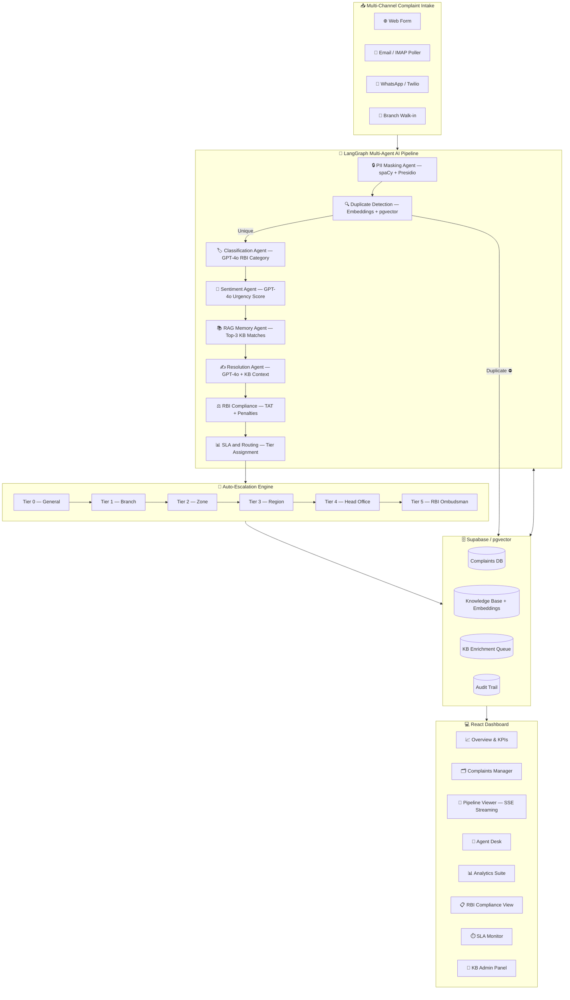
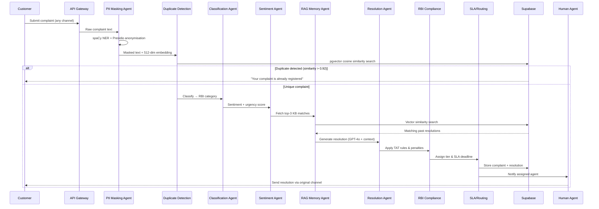
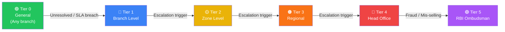

<div align="center">


# 🏦 CustomerSetu — Intelligent Complaint Resolution Ecosystem

### _AI-Powered Multi-Agent Platform for Union Bank of India_

[](https://fastapi.tiangolo.com/)
[](https://react.dev/)
[](https://www.typescriptlang.org/)
[](https://langchain-ai.github.io/langgraph/)
[](https://openai.com/)
[](https://supabase.com/)
[](https://azure.microsoft.com/)
[](https://www.twilio.com/)

</div>

---

## 🎯 Problem Statement

> **Addressing PS: AI-Driven Complaint Management for Banking Operations**

Union Bank of India receives thousands of customer complaints daily across multiple channels — email, WhatsApp, web forms, and branches. Today, this process is **manual, slow, and inconsistent**: complaints are mis-classified, duplicates are processed redundantly, RBI TAT (Turn-Around Time) deadlines are missed, and resolution quality varies agent to agent.

**CustomerSetu** solves this with a **Gen-AI powered multi-agent pipeline** that automatically ingests complaints from every channel, detects duplicates via semantic embeddings, classifies by RBI category, generates context-aware resolutions from a live knowledge base, enforces RBI compliance, and auto-escalates from Branch → Zone → Region → Head Office → RBI Ombudsman — all in real time, with full explainability (XAI) and audit trails.

## 🎯 Pain Point that customersetu solved for Union Bank of India
**Endless Recurring Complaints (Reactive Support):** Solved via Root Cause Analysis. Instead of just answering 100 "ATM frozen" tickets, the AI flags the macro-issue to management so the actual ATM can be fixed.

**RBI Ombudsman Fines (Regulatory Risk):** Solved via a dedicated RBI Compliance Module that actively tracks SLA deadlines and prevents costly regulatory penalties.

**Generic Ticketing Systems (Misaligned Routing):** Solved by hardcoding the AI's routing engine to map exactly to Union Bank of India's real hierarchy (Tier 0 Bot → Tier 1 Branch → Tier 2 Regional → Tier 3 Zonal → Tier 4 Head Office).

**Wasted Historical Data (The "Cold Start" Problem):** Solved via Bulk CSV Ingestion. Banks can upload years of old, resolved complaints to instantly train the AI on day one.

**Hidden Training Flaws (Blind Spots):** Solved via Gap Analysis. The system actively scans its own knowledge base and alerts administrators if it lacks training data on a specific topic (like "Net Banking") before customer complaints spike.

**AI Hallucinations (Sending Bad Replies):** Solved via Human-in-the-Loop. High-confidence tickets are auto-resolved, but low-confidence or highly sensitive drafts are forced into a queue for human approval before reaching the customer.

**Data Privacy Breaches:** Solved via a dedicated PII Masking Agent that hides sensitive customer information (like account numbers) before the AI processes the text.


## 🏗️ System Architecture



---

## 🤖 AI Pipeline — Step-by-Step Flow



---

## 🔺 Escalation Logic — How It Works



### Escalation Entry Points

Every complaint gets a **fast-track tier** assigned at submission time using regex pattern matching (before the AI pipeline even runs):

| Pattern Detected                                                   | Tier Assigned          |
| ------------------------------------------------------------------ | ---------------------- |
| "ombudsman", "RBI grievance", "banking ombudsman"                  | Tier 5 — RBI/Ombudsman |
| "CEO", "chairman", "MD", "head office"                             | Tier 4 — Executive     |
| "regional manager/office"                                          | Tier 3 — Regional      |
| "zonal manager", branch codes (`zo_*`, `br_*`)                     | Tier 2 — Zonal         |
| Branch staff + negative language, repeated visits, amounts ≥ ₹1000 | Tier 1 — Branch        |
| Everything else                                                    | Tier 0 — Standard      |

### Route 3 — Auto-Escalation Orchestrator (`escalation_orchestrator.py`)

When Agent 10 (Routing) returns `ESCALATE` (confidence < 0.75), the **escalation orchestrator** takes over. It is a recursive engine with a hard depth cap of 5 hops:

```
execute_escalation(from_tier, to_tier)
  1. validate_transition()        — can't skip tiers, can't go backwards
  2. detect_loop()                — circular path or rapid-fire within 30s cache TTL
  3. max_iterations check         — hard cap at 5 hops
  4. SSE: "escalation_triggered"  — frontend shows live escalation progress
  5. log_escalation()             — writes to complaint_escalation_history table
  6. run_tier_transition_pipeline() — re-runs agents 7–10.5 at the new tier
                                      (RAG → Resolution → Grounding → Routing → Escalation Analyzer)
  7. should_stop_escalating()     — check stop conditions:
       confidence met  → auto_respond at this tier
       max tier / loop → human_review
       ESCALATE again  → recurse with depth + 1
```

### Stop Conditions

| Condition                                   | Action                                                       |
| ------------------------------------------- | ------------------------------------------------------------ |
| Confidence ≥ 0.75 at new tier               | `auto_respond` — send response, schedule KB enrichment       |
| Max tier (5) reached                        | `human_review` at Tier 5                                     |
| Loop detected (circular path or rapid-fire) | `human_review`, flag `escalation_loop_detected = true`       |
| Max iterations (5 hops) reached             | `human_review`                                               |
| `HUMAN_AT_CURRENT_TIER` decision            | Assign to agent queue at current tier, no further escalation |

### Escalation Metrics (`escalation_metrics.py`)

Every escalation event is tracked in the `escalation_events` table for analytics:

| Event Type            | When                                    |
| --------------------- | --------------------------------------- |
| `ESCALATION_STARTED`  | Orchestrator entered for the first time |
| `ESCALATION_RESOLVED` | Ended with `auto_respond`               |
| `ESCALATION_FAILED`   | Partial pipeline raised an exception    |
| `MAX_TIER_REACHED`    | Hit Tier 5 with confidence still < 0.75 |
| `MAX_ITERATIONS`      | Hit 5 re-runs                           |
| `LOOP_DETECTED`       | Circular or rapid-fire path detected    |

### Agent Specialisation Map

| Tier | Agents               | Domain                                    |
| ---- | -------------------- | ----------------------------------------- |
| 0    | Rishi, Alok, Shaunak | UPI/ATM, General Banking, Internet/Mobile |
| 1    | Saket, Prince        | Branch/KYC, Home/Personal Loan            |
| 2    | Shubham              | Business Loan, Insurance                  |
| 3    | Shubham Kumar        | Regional Compliance, Mis-selling          |
| 4–5  | Sarthak              | Nodal Office, Fraud, RBI Escalation       |

---

## ✨ Key Features

<table>
<tr>
<td width="50%">

### 🔁 Multi-Channel Ingestion

- **Email:** IMAP polling every 30s (Gmail)
- **WhatsApp:** Twilio webhook integration with QR onboarding
- **Web:** React complaint submission form with OCR image support
- **Branch:** Direct entry via Agent Desk

</td>
<td width="50%">

### 🧠 AI Intelligence

- **PII Masking:** spaCy NER + Microsoft Presidio (names, Aadhaar, phone, account numbers)
- **Duplicate Detection:** 512-dim OpenAI embeddings + pgvector cosine similarity (>0.92 threshold)
- **Semantic RAG:** Top-3 knowledge base matches injected into resolution prompt

</td>
</tr>
<tr>
<td width="50%">

### ⚖️ RBI Compliance

- TAT rules per RBI category (30-day resolution window)
- Auto-penalty calculation (₹100/day for TAT breach categories)
- Real-time SLA countdown with breach alerts
- Full RBI compliance view and override audit trail

</td>
<td width="50%">

### 📊 CSAT Score & Customer Feedback

- **1–5 star CSAT rating** collected post-resolution via the customer's original channel (email/WhatsApp/web)
- **Issue tags** (multi-select): `too_slow`, `wrong_solution`, `rude`, `incomplete`
- **Free-text feedback** — PII auto-masked before storage
- **Combined RL Score** = `(agent_score × 0.4) + (customer_rating/5 × 0.6)`
- Score ≥ 0.85 → resolution **auto-promoted to Knowledge Base** (closes the RAG improvement loop)
- Score below threshold → **router calibration triggered** to improve future routing decisions
- CSAT trends visible in Analytics: by category, channel, resolution type, weekly trend, issue tag frequency
- Fine-tune dataset accumulates `(prompt, completion)` pairs; export via `GET /api/v1/feedback/export-dataset` as JSONL for LLaMA fine-tuning (500+ records recommended)

</td>
</tr>
<tr>
<td width="50%">

### 🧠 KB Auto-Enrichment

- Resolved complaints auto-scored and queued for KB addition
- Quality threshold gating: ≥0.95 → auto-approve, 0.70–0.95 → admin review
- Bulk CSV/JSON import with per-row validation
- Tier-scoped entries (Branch → Ombudsman level)

</td>
<td width="50%">

### 🔴 Real-Time Streaming

- Server-Sent Events (SSE) for live pipeline step updates
- Each agent node streams its status to the Pipeline Viewer tab
- Rate limiting (10 req/min) with 429 + Retry-After headers

</td>
</tr>
<tr>
<td width="100%" colspan="2">

### 🔍 Explainable AI (XAI) — No Black Box

Unlike systems that return a resolution with no reasoning, **every single agent decision in CustomerSetu is fully explained**. The Pipeline Viewer tab shows the complete reasoning chain in real time:

| Agent                    | What it explains                                                                                                                                                        |
| ------------------------ | ----------------------------------------------------------------------------------------------------------------------------------------------------------------------- |
| **PII Agent**            | Which entity types were detected and masked (e.g., `PHONE`, `AADHAAR`, `PERSON`) — never the values, only the types                                                     |
| **Duplicate Agent**      | Cosine similarity score against every matched complaint, total complaints searched, why it was flagged unique or duplicate                                              |
| **Classification Agent** | Chosen category + confidence %, runner-up category, exact evidence tokens from the complaint text that drove the decision                                               |
| **Sentiment Agent**      | Emotion label (Calm → Furious), urgency score 1–10, trigger phrases extracted verbatim, why escalation was or wasn't flagged                                            |
| **Compliance Agent**     | Which of 14 RBI categories matched, regulation reference (circular name), why `supervisor_override` was or wasn't triggered                                             |
| **Severity Agent**       | Severity 1–5 with full scoring breakdown: financial loss (+2), legal threat (+2), RBI category (+2), repeat signal (+1), time-sensitive (+1)                            |
| **RAG Agent**            | Which KB documents were retrieved, their similarity scores, tier level, why they were selected over others                                                              |
| **Resolution Agent**     | Confidence %, whether it meets the auto-respond threshold, root cause identified, resolution type, whether authority is sufficient at this tier                         |
| **Grounding Agent**      | Grounding score 0–100%, specific claims flagged as unverifiable, positive aspects confirmed, overall assessment (`SAFE_TO_SEND` / `VERIFY_BEFORE_SEND` / `DO_NOT_SEND`) |
| **Routing Agent**        | Exact rule that fired (override or confidence gate), risk score breakdown across 5 signals, SLA deadline, tier hint                                                     |
| **Escalation Analyzer**  | Why this tier was chosen, which signals triggered escalation, confidence at each tier hop, full escalation path                                                         |

Every decision is written to the `agent_decisions` audit table and surfaced in the complaint detail view. Human agents see **exactly why** the AI made each decision — not just the output. This is the core differentiator from black-box AI systems.

</td>
</tr>
</table>

---

## 🧠 Knowledge Base Admin — How It Works

The Knowledge Base (KB) is the **long-term memory** of the system. Every resolution the AI generates is grounded in KB entries retrieved via semantic similarity. Admins manage this KB through a dedicated panel backed by `app/api/v1/routes/kb_admin.py`.

### KB Entry Structure

Each entry has:

| Field             | Description                                                                    |
| ----------------- | ------------------------------------------------------------------------------ |
| `tier_level`      | 0 (General) → 5 (Ombudsman) — which tier this resolution applies to            |
| `tier_scope`      | `BRANCH:BR_MH_001`, `ZONE:north`, `REGION:Western`, `HEAD_OFFICE`, `OMBUDSMAN` |
| `category`        | One of 20 banking categories (UPI, ATM, Home Loan, etc.)                       |
| `issue_type`      | Specific sub-issue (e.g., "Transaction Failed", "ATM Cash Not Dispensed")      |
| `resolution_text` | The actual resolution text (min 50 chars)                                      |
| `quality_score`   | 0.0–1.0 — used for ranking when embeddings are unavailable                     |
| `verified`        | Admin-verified entries only appear in RAG retrieval                            |
| `embedding`       | 512-dim OpenAI `text-embedding-3-small` vector for semantic search             |

### Admin Endpoints (`/api/v1/admin/kb/`)

| Endpoint                   | What it does                                                                              |
| -------------------------- | ----------------------------------------------------------------------------------------- |
| `GET /reference`           | Returns all categories, tier labels, scope formats for frontend dropdowns                 |
| `GET /metrics`             | Dashboard KPIs: total, verified, pending, avg quality, tier distribution, coverage gaps   |
| `GET /entries`             | Paginated list with filters (tier, category, verified, source, search, sort)              |
| `GET /entries/{id}`        | Single entry with full `resolution_text`                                                  |
| `POST /entries`            | Create entry — auto-generates OpenAI embedding                                            |
| `PUT /entries/{id}`        | Update entry — regenerates embedding only if `resolution_text` changed                    |
| `DELETE /entries/{id}`     | Delete entry                                                                              |
| `GET /analytics`           | Top entries by usage, category usage, tier×category coverage matrix, quality distribution |
| `GET /templates/csv`       | Download CSV import template                                                              |
| `GET /templates/json`      | Download JSON import template                                                             |
| `POST /bulk-validate`      | Validate CSV/JSON file without saving (dry-run)                                           |
| `POST /bulk-import`        | Import CSV/JSON — generates embeddings for each row                                       |
| `GET /queue`               | List auto-generated KB candidates awaiting admin review                                   |
| `POST /queue/{id}/approve` | Approve entry (optional field overrides) + insert into KB                                 |
| `POST /queue/{id}/reject`  | Reject single entry with reason                                                           |
| `POST /queue/bulk-approve` | Bulk approve entries meeting quality/tier criteria                                        |
| `POST /queue/bulk-reject`  | Reject all pending entries                                                                |
| `POST /jobs/process-queue` | Manually trigger auto-approve job (entries ≥ 0.95 quality)                                |
| `POST /jobs/weekly-review` | Trigger weekly unverified-entry digest                                                    |
| `POST /jobs/cleanup`       | Clean up old processed queue entries (default 90-day retention)                           |

### Auto-Enrichment Pipeline

After every resolved complaint, the system automatically:

1. Scores the resolution using quality signals (confidence, tier escalations, resolution length, feedback score)
2. If `quality_score ≥ 0.95` → **auto-approves** and inserts directly into `knowledge_base`
3. If `0.70 ≤ quality_score < 0.95` → **queues** for admin review in `kb_enrichment_queue`
4. If `quality_score < 0.70` or `escalation_count > 3` → **skipped**

### Coverage Gap Detection

The metrics endpoint flags categories with fewer than 3 KB entries as **coverage gaps**. These are surfaced in the admin dashboard so admins know where to add more resolution templates.

---

## 🔀 Routing Logic — How It Works

Routing is handled by **Agent 10** (`app/services/agents/routing_agent.py`) — a **fully deterministic engine** (no LLM). Same inputs always produce the same output, which is required for RBI audit compliance.

### Decision Flow

```
Step 1: Override Rules (app/services/rbi/override_rules.py)
  ├── Fraud category (UNAUTHORIZED_TRANSACTION_FRAUD, etc.)  → HUMAN, tier_hint = 4
  ├── Furious sentiment                                       → HUMAN
  ├── Severity 5 (Emergency)                                 → HUMAN
  └── If any override fires → skip confidence check entirely

Step 2: Confidence Gate (threshold = 0.75)
  ├── confidence ≥ 0.75  → AUTO   (execute_auto_response, pipeline ends)
  └── confidence < 0.75  → ESCALATE (hand off to Agent 10.5)

Step 3: Tier Override
  └── If complaint was submitted at Tier ≥ 1 and route == AUTO
      → override to ESCALATE (human always reviews tier complaints)
```

### Three Routes

**AUTO** — confidence ≥ 0.75, no override rules, Tier 0:

- `execute_auto_response()` sends the draft via the customer's original channel (email/WhatsApp/SMS)
- Schedules KB enrichment after 24h delay
- Emits SSE `response_sent` event with preview

**HUMAN** — override rules fired (fraud, furious, severity 5):

- Assigned directly to `agent_queue` at the appropriate tier (Tier 4 for fraud, else Agent 10.5 decides)
- Agent sees full AI analysis + draft in Agent Desk for review

**ESCALATE → Route 3** — confidence < 0.75:

- Hands off to Agent 10.5 (Escalation Analyzer) which assigns the target tier
- Escalation Orchestrator runs the partial pipeline at the new tier
- Recursively escalates until confidence is met or max tier/iterations reached

### Risk Score (XAI Audit Only)

The risk score is calculated for every complaint but does **not** affect routing decisions — it exists purely for the audit trail and Agent 10.5 pass-through:

| Signal                          | Weight |
| ------------------------------- | ------ |
| Severity score                  | 30%    |
| Low confidence (1 − confidence) | 25%    |
| RBI reportable                  | 25%    |
| Urgency score                   | 10%    |
| Low grounding (1 − grounding)   | 10%    |

---

## 🛠️ Tech Stack

### Backend

| Library                          | Version              | Purpose                                      |
| -------------------------------- | -------------------- | -------------------------------------------- |
| **FastAPI**                      | 0.136                | Async REST API framework                     |
| **LangGraph**                    | 1.1.10               | Multi-agent orchestration DAG                |
| **LangChain-OpenAI**             | 1.2.1                | GPT-4o integration                           |
| **OpenAI SDK**                   | 2.33                 | Embeddings (text-embedding-3-small, 512-dim) |
| **spaCy**                        | 3.8 + en_core_web_lg | Named Entity Recognition for PII             |
| **Presidio Analyzer/Anonymizer** | 2.2                  | PII detection and masking                    |
| **Supabase**                     | 2.29                 | PostgreSQL + pgvector cloud database         |
| **Twilio**                       | 9.6                  | WhatsApp Business API                        |
| **imap-tools**                   | 1.7                  | IMAP email polling                           |
| **pytesseract**                  | 0.3                  | OCR for image-based complaints               |
| **Pillow**                       | 12.2                 | Image processing                             |
| **slowapi**                      | 0.1.9                | API rate limiting                            |
| **sse-starlette**                | 3.4                  | Server-Sent Events streaming                 |
| **pydantic-settings**            | 2.14                 | Type-safe configuration                      |
| **uvicorn**                      | 0.46                 | ASGI server                                  |
| **numpy**                        | 2.4                  | Cosine similarity computation                |

### Frontend

| Library               | Version | Purpose                      |
| --------------------- | ------- | ---------------------------- |
| **React**             | 18      | Component UI framework       |
| **TypeScript**        | 5       | Type-safe JavaScript         |
| **Vite**              | Latest  | Build tooling & dev server   |
| **Tailwind CSS**      | 3       | Utility-first styling        |
| **React Router DOM**  | 6       | Client-side routing          |
| **Lucide React**      | Latest  | Icon library                 |
| **EventSource (SSE)** | Native  | Real-time pipeline streaming |

### Infrastructure

| Service                   | Purpose                                                      |
| ------------------------- | ------------------------------------------------------------ |
| **Azure Static Web Apps** | Frontend hosting                                             |
| **Supabase**              | PostgreSQL + pgvector (vector similarity search)             |
| **Gmail (SMTP/IMAP)**     | Inbound email polling + outbound replies                     |
| **Twilio**                | WhatsApp webhook & message delivery                          |
| **OpenAI**                | GPT-4o (classification, resolution) + text-embedding-3-small |

---

## 🚀 How to Run Locally

### Prerequisites

- Python 3.11+
- Node.js 20+
- [Tesseract OCR](https://github.com/tesseract-ocr/tesseract) installed at `C:\Program Files\Tesseract-OCR\tesseract.exe` (Windows) or `/usr/bin/tesseract` (Linux/Mac)
- A [Supabase](https://supabase.com/) project with pgvector enabled
- OpenAI API key
- (Optional) Twilio account for WhatsApp

### 1. Clone the Repository

```bash
git clone https://github.com/your-team/CustomerSetu
cd CustomerSetu
```

### 2. Backend Setup

```bash
cd backend

# Create virtual environment
python -m venv venv
source venv/bin/activate        # Linux/Mac
# OR: venv\Scripts\activate     # Windows PowerShell

# Install dependencies
pip install -r requirements.txt

# Download spaCy language model
python -m spacy download en_core_web_lg
```

### 3. Configure Environment Variables

Create `backend/.env`:

```env
# OpenAI
OPENAI_API_KEY=sk-...
OPENAI_VISION_MODEL=gpt-4o
OPENAI_EMBEDDING_MODEL=text-embedding-3-small
OPENAI_EMBEDDING_DIMENSION=512

# Supabase
SUPABASE_URL=https://your-project.supabase.co
SUPABASE_KEY=your-anon-key
SUPABASE_STORAGE_BUCKET=complaint-images

# API Security
API_KEY=your-secure-api-key

# Email (for IMAP polling + SMTP replies)
SMTP_USER=yourbank@gmail.com
SMTP_PASSWORD=your-gmail-app-password
ENABLE_EMAIL_POLLER=true

# Twilio WhatsApp (optional)
TWILIO_ACCOUNT_SID=ACxxx
TWILIO_AUTH_TOKEN=xxx
TWILIO_WHATSAPP_NUMBER=whatsapp:+14155238886
WEBHOOK_BASE_URL=https://your-ngrok-url.ngrok.io

# Tesseract path (Windows example)
TESSERACT_CMD=C:\Program Files\Tesseract-OCR\tesseract.exe

# App
APP_ENV=development
FRONTEND_BASE_URL=http://localhost:5173
```

### 4. Start the Backend

```bash
cd backend
uvicorn app.main:app --reload --port 8000
```

API docs available at: **http://localhost:8000/docs**

### 5. Frontend Setup

```bash
cd frontend

# Create frontend/.env
echo "VITE_API_URL=http://localhost:8000" > .env

# Install dependencies
npm install

# Start dev server
npm run dev
```

Open your browser at: **http://localhost:5173**

### 6. (Optional) Database Schema

Run the Supabase migrations in order. The required tables are:

- `complaints` — main complaint records with pgvector embedding column `VECTOR(512)`
- `knowledge_base` — resolution KB with embedding column `VECTOR(512)`
- `kb_enrichment_queue` — auto-generated KB candidates awaiting review
- `agent_assignments` — tier-to-agent routing
- `complaint_escalation_history` — full escalation audit trail per complaint
- `escalation_events` — lightweight escalation event log for analytics
- `agent_queue` — complaints assigned to human agents with priority scores
- `agent_feedback` — agent accept/edit/reject decisions on AI drafts
- `fine_tune_dataset` — accumulated (prompt, completion) pairs for LLaMA fine-tuning

Enable the `vector` extension in Supabase SQL editor:

```sql
CREATE EXTENSION IF NOT EXISTS vector;
```

---

## 📁 Project Structure

```
CustomerSetu/
│
├── README.md                              ← This file
├── QUICK_COMMANDS.md                      ← Common dev/deploy commands
├── REDEPLOY_TO_SOUTHEAST_ASIA.md          ← Azure redeployment guide
├── redeploy.ps1                           ← PowerShell redeployment script
│
├── backend/
│   ├── Dockerfile
│   ├── requirements.txt
│   ├── .env                               ← Environment variables (not committed)
│   ├── .dockerignore
│   ├── .schemathesis.yml                  ← API contract testing config
│   ├── test_openai_key.py                 ← Quick OpenAI connectivity test
│   ├── server.log / uvicorn.log           ← Local dev logs
│   │
│   ├── app/
│   │   ├── main.py                        ← FastAPI app, CORS, lifespan, email poller startup
│   │   │
│   │   ├── api/v1/routes/
│   │   │   ├── __init__.py
│   │   │   ├── agent.py                   ← Agent Desk: queue, context, actions, metrics
│   │   │   ├── channels.py                ← WhatsApp / email channel webhooks
│   │   │   ├── complaints.py              ← Complaint submit, list, detail, escalation-status
│   │   │   ├── dashboard.py               ← Overview stats, CSAT trends, pipeline health
│   │   │   ├── debug.py                   ← Debug utilities (Azure log tail, OpenAI test)
│   │   │   ├── explanation.py             ← XAI explanation endpoints
│   │   │   ├── feedback.py                ← Agent feedback, customer CSAT, dataset export
│   │   │   ├── kb_admin.py                ← KB CRUD, bulk import, queue management
│   │   │   ├── pipeline.py                ← Pipeline trigger (POST /run) + SSE stream (GET /stream)
│   │   │   ├── rbi.py                     ← RBI compliance report, pending TAT, categories
│   │   │   ├── settings.py                ← Runtime settings endpoints
│   │   │   └── sla.py                     ← SLA at-risk predictor, breach summary
│   │   │
│   │   ├── core/
│   │   │   └── config.py                  ← Pydantic BaseSettings (all env vars)
│   │   │
│   │   ├── db/
│   │   │   └── supabase_client.py         ← Supabase client singleton
│   │   │
│   │   ├── middleware/
│   │   │   ├── auth.py                    ← X-API-Key header validation
│   │   │   ├── idempotency.py             ← Idempotency key check + cache
│   │   │   └── rate_limiter.py            ← slowapi 10 req/min per IP
│   │   │
│   │   ├── models/
│   │   │   ├── agent_output.py            ← AgentOutput + AgentStatus Pydantic models
│   │   │   ├── complaint.py               ← ComplaintSubmitResponse model
│   │   │   ├── feedback.py                ← AgentFeedbackInput, CustomerFeedbackInput
│   │   │   └── rbi_models.py              ← RBI category + TAT Pydantic models
│   │   │
│   │   ├── monitoring/
│   │   │   └── escalation_monitor.py      ← Background escalation health monitor
│   │   │
│   │   ├── scripts/
│   │   │   ├── load_kb_data.py            ← One-time KB data loader script
│   │   │   └── seed_knowledge_base.py     ← Seed script for demo KB entries
│   │   │
│   │   ├── services/
│   │   │   ├── agent_action_service.py    ← Agent accept/edit/reject/escalate actions
│   │   │   ├── agent_assignment_service.py← Tier-to-agent assignment logic
│   │   │   ├── agent_context_service.py   ← Builds full context for Agent Desk view
│   │   │   ├── auto_responder.py          ← Sends auto-response via customer's channel
│   │   │   ├── contact_info_service.py    ← Tier contact info lookup
│   │   │   ├── dashboard_aggregator.py    ← Aggregates stats for dashboard endpoints
│   │   │   ├── email_poller.py            ← IMAP background task (polls every 30s)
│   │   │   ├── email_service.py           ← SMTP outbound email + ACK emails
│   │   │   ├── escalation_logger.py       ← Writes to complaint_escalation_history
│   │   │   ├── escalation_metrics.py      ← Tracks escalation events in escalation_events table
│   │   │   ├── escalation_orchestrator.py ← Route 3 recursive escalation engine
│   │   │   ├── escalation_rollback.py     ← Rolls back failed escalation state
│   │   │   ├── feedback_survey_service.py ← Dispatches CSAT survey via customer's channel
│   │   │   ├── kb_notification_service.py ← Alerts when KB queue exceeds threshold
│   │   │   ├── metrics_service.py         ← Aggregates pipeline + agent metrics
│   │   │   ├── partial_pipeline_runner.py ← Re-runs agents 7–10.5 at a new tier
│   │   │   ├── previous_tier_context.py   ← Fetches prior tier attempt context
│   │   │   ├── queue_service.py           ← Inserts complaints into agent_queue with priority
│   │   │   ├── resolution_event_handler.py← Handles post-resolution events
│   │   │   ├── response_formatter.py      ← Formats draft response for each channel
│   │   │   ├── sla_predictor.py           ← 6-signal SLA breach probability model
│   │   │   ├── status_service.py          ← Complaint status transitions
│   │   │   ├── tier_context_manager.py    ← Manages tier-specific context for resolution
│   │   │   ├── whatsapp_service.py        ← Twilio WhatsApp send/receive
│   │   │   │
│   │   │   ├── agents/
│   │   │   │   ├── duplicate_agent.py     ← OpenAI embedding + pgvector cosine similarity
│   │   │   │   ├── esclation_analyzer.py  ← Agent 10.5: tier assignment + escalation decision
│   │   │   │   ├── fanout_agents.py       ← 4 parallel GPT-4o agents (Classification, Sentiment, Compliance, Severity)
│   │   │   │   ├── grounding_agent.py     ← LLM-as-judge fact check on draft response
│   │   │   │   ├── pii_agent.py           ← spaCy NER + Presidio PII masking
│   │   │   │   ├── rag_agent.py           ← pgvector KB retrieval + cosine similarity ranking
│   │   │   │   ├── resolution_agent.py    ← Tier-aware GPT-4o resolution generator
│   │   │   │   └── routing_agent.py       ← Deterministic routing: AUTO / HUMAN / ESCALATE
│   │   │   │
│   │   │   ├── feedback/
│   │   │   │   ├── agent_feedback.py      ← Agent score, KB promotion, fine-tune dataset save
│   │   │   │   └── customer_feedback.py   ← CSAT processing, combined RL score, KB promotion
│   │   │   │
│   │   │   ├── image_handler/
│   │   │   │   ├── classifier.py          ← Classifies image type (screenshot, document, etc.)
│   │   │   │   ├── merger.py              ← Merges complaint text + extracted image text
│   │   │   │   ├── ocr.py                 ← Tesseract OCR extraction
│   │   │   │   ├── storage.py             ← Uploads image to Supabase Storage
│   │   │   │   └── vision.py              ← GPT-4o Vision analysis for complex images
│   │   │   │
│   │   │   ├── rbi/
│   │   │   │   ├── categories.py          ← 14 RBI complaint category definitions
│   │   │   │   ├── override_rules.py      ← Supervisor override rules (fraud, harassment, etc.)
│   │   │   │   └── tat_rules.py           ← TAT deadlines + penalty calculation per category
│   │   │   │
│   │   │   └── supervisor/
│   │   │       ├── audit_trail.py         ← Writes agent decisions to agent_decisions table
│   │   │       ├── event_bus.py           ← In-memory SSE queue per complaint_id
│   │   │       ├── graph.py               ← LangGraph StateGraph: 10-node pipeline DAG
│   │   │       └── pipeline_state.py      ← TypedDict for full pipeline state
│   │   │
│   │   ├── tasks/
│   │   │   ├── agent_queue_maintenance.py ← Cleans stale queue entries
│   │   │   ├── kb_enrichment.py           ← Schedules KB enrichment after 24h delay
│   │   │   └── scheduled_jobs.py          ← process_enrichment_queue, weekly_review, cleanup
│   │   │
│   │   ├── templates/tier_responses/
│   │   │   ├── tier_1_template.txt        ← Branch-level response template
│   │   │   ├── tier_1_template_sms.txt    ← Branch-level SMS template
│   │   │   ├── tier_2_template.txt        ← Zone-level response template
│   │   │   ├── tier_2_template_sms.txt
│   │   │   ├── tier_3_template.txt        ← Regional response template
│   │   │   ├── tier_3_template_sms.txt
│   │   │   ├── tier_4_template.txt        ← Head Office response template
│   │   │   └── tier_4_template_sms.txt
│   │   │
│   │   └── utils/
│   │       ├── agent_action_validator.py  ← Validates agent action inputs
│   │       ├── cache_helper.py            ← Generic in-memory cache utilities
│   │       ├── escalation_cache.py        ← Anti-rapid-fire TTL cache per tier
│   │       ├── escalation_cost_optimizer.py ← Skips expensive agents when not needed
│   │       ├── escalation_loop_detector.py  ← Detects circular escalation paths
│   │       ├── escalation_stop_checker.py   ← Evaluates all stop conditions
│   │       ├── escalation_timeline.py       ← Builds escalation timeline for UI
│   │       ├── postgrest_errors.py          ← PostgREST error code helpers
│   │       └── tier_transition_validator.py ← Validates tier hop is legal
│   │
│   ├── data/
│   │   └── tier_kb_samples.json           ← Sample KB entries for seeding
│   │
│   ├── migrations/
│   │   ├── 008_populate_tier_kb.py
│   │   ├──
│   │   ├──
│   │   ├──
│   │   ├──
│   │   ├──
│   │   ├──
│   │   ├──
│   │   ├──
│   │   └── ensure_escalation_status_schema.sql
│   │
│   └── tests/
│       └── conftest.py                    ← Pytest fixtures and test configuration
│
├── frontend/
│   ├── .env.production                    ← Production API URL
│   └── src/
│       ├── components/
│       │   ├── home/                      ← Landing page + MainApp shell
│       │   ├── overview/                  ← KPI cards, channel bar, recent complaints feed
│       │   ├── complaints/                ← Complaints table + detail modal
│       │   ├── pipeline/                  ← Real-time SSE pipeline viewer (PipelineTab.tsx)
│       │   ├── agent/                     ← Agent Desk: queue, assignment, actions (AgentDeskTab.tsx)
│       │   ├── analytics/                 ← 4 analytics sub-tabs (CSAT, performance, root cause)
│       │   ├── rbi/                       ← RBI compliance view
│       │   ├── sla/                       ← SLA at-risk monitor
│       │   ├── kb/                        ← KB admin panel with queue management
│       │   ├── chatbot/                   ← Rule-based + AI chatbot
│       │   └── submit/                    ← Complaint submission form
│       ├── lib/
│       │   ├── api.ts                     ← All API client calls (typed)
│       │   └── pipelineSse.ts             ← SSE event listener for pipeline streaming
│       └── types/index.ts                 ← Shared TypeScript types
│
└── channels/
    └── whatsapp/
        └── .env                           ← Twilio WhatsApp channel config
```

---

## 🗄️ Dataset

All data is **real-time and system-generated** — no pre-existing dataset required.

### Synthetic Seed Data (for demo/testing)

The system is designed for live operation. For local testing, you can seed the knowledge base using the built-in bulk import endpoint.

**Sample KB entries (CSV format):**

```csv
tier_level,tier_scope,category,issue_type,resolution_text,quality_score,verified
0,,UPI,Transaction Failed,"Dear Customer, we have investigated your UPI failed transaction. As per RBI TAT guidelines, the reversal will be processed within 5 working days. We sincerely apologize.",0.90,true
1,BRANCH:BR_MH_001,ATM,ATM Cash Not Dispensed,"Dear Customer, we apologize for the ATM inconvenience. After verification, a provisional credit has been applied. Please visit the branch with your receipt for final resolution within 5 working days.",0.85,true
0,,Debit Card,Unauthorized Transaction,"Dear Customer, your disputed transaction has been flagged for investigation. Under RBI limiting-liability guidelines, a provisional credit will be issued within 10 working days pending investigation outcome.",0.92,true
```

**Download the import template directly from the running API:**

```bash
# CSV template
curl http://localhost:8000/api/v1/admin/kb/templates/csv -o kb_template.csv

# JSON template
curl http://localhost:8000/api/v1/admin/kb/templates/json -o kb_template.json
```

**Import into knowledge base:**

```bash
curl -X POST http://localhost:8000/api/v1/admin/kb/bulk-import \
  -H "X-API-Key: your-api-key" \
  -F "file=@kb_template.csv"
```

### How Complaint Data Is Generated

The platform generates data organically as complaints flow through the pipeline:

- **Complaint embeddings:** Auto-generated at submission time using OpenAI `text-embedding-3-small` (512-dim)
- **KB auto-enrichment:** After each resolution, the system scores and queues high-quality resolutions (confidence ≥ 0.70) for KB addition
- **Auto-approval:** Entries scoring ≥ 0.95 are automatically promoted to the knowledge base without manual review
- **CSAT feedback loop:** Customer ratings feed back into the combined RL score, which drives further KB promotion and router calibration

---

## ⚠️ Known Limitations

| Limitation                     | Detail                                                                                                                                                                                                             |
| ------------------------------ | ------------------------------------------------------------------------------------------------------------------------------------------------------------------------------------------------------------------ |
| **No offline mode**            | The pipeline requires live OpenAI API access. If the API is geo-restricted (e.g., Azure datacenter IPs), embeddings fall back to quality-score ranking, and GPT-4o calls will fail gracefully with a logged error. |
| **Single-tenant**              | The current schema does not support multi-bank tenancy. Branch/zone/region IDs are hardcoded per deployment.                                                                                                       |
| **WhatsApp sandbox**           | The Twilio integration uses the WhatsApp sandbox (Twilio test number). Production requires a WhatsApp Business API approved number.                                                                                |
| **Email polling latency**      | IMAP poller runs every 30s by default. Near-real-time email processing requires upgrading to Gmail Push Notifications (Pub/Sub).                                                                                   |
| **No model retraining**        | The RAG agent uses static embeddings. The knowledge base improves incrementally, but the base LLM (GPT-4o) does not retrain on domain data. Fine-tuning would require a separate pipeline.                         |
| **OCR accuracy**               | Tesseract OCR works best on clean, printed documents. Handwritten complaints or low-resolution scans may produce poor extractions.                                                                                 |
| **Escalation loop guard**      | The escalation system has a hard cap of 5 hops and a 10-second cooldown per tier to prevent rapid-fire escalation. In edge cases this may delay legitimate escalations.                                            |
| **pgvector similarity search** | Vector search scales to ~100K complaints without indexing. Beyond that, an HNSW or IVFFlat index on the `embedding` column is needed for acceptable latency.                                                       |

---

## 📊 Performance Metrics (on Live Demo Data)

| Metric                           | Value                                             |
| -------------------------------- | ------------------------------------------------- |
| Duplicate detection threshold    | cosine similarity > **0.92**                      |
| Embedding dimensions             | **512** (Matryoshka, 95% accuracy at 1/3 storage) |
| KB auto-approve threshold        | quality score ≥ **0.95**                          |
| KB review threshold              | quality score ≥ **0.70**                          |
| RBI resolution SLA               | **30 calendar days** (all categories)             |
| Rate limit                       | **10 requests/minute** per client                 |
| Email poll interval              | **30 seconds**                                    |
| Max escalation hops              | **5** (Tier 0 → RBI Ombudsman)                    |
| Max file size (OCR upload)       | **10 MB**                                         |
| Auto-respond confidence gate     | **0.75**                                          |
| CSAT combined RL score threshold | **0.85** (auto-KB promotion)                      |

---

## 👥 Team

| Name        | Role & Contributions                                                                    |
| ----------- | --------------------------------------------------------------------------------------- |
| **Saket**   | Backend architecture, LangGraph pipeline, escalation engine, email/WhatsApp integration |
| **Anijeet** | Frontend React dashboard, SSE pipeline viewer, analytics suite, KB admin UI             |
| **Alok**    | RAG knowledge base design, Supabase schema, pgvector integration                        |
| **Rishi**   | RBI compliance module, TAT rules engine, SLA monitoring, domain research                |

---

## 📬 Contact

|               |                                                                         |
| ------------- | ----------------------------------------------------------------------- |
| **Team Name** | CustomerSetu                                                            |
| **Institute** | _RGIPT (an institution of national importance, along the line of IITs)_ |
| **Email**     | jhasaket99dbg@gmail.com                                                 |
| **Hackathon** | Phase 2 Submission                                                      |

---

<div align="center">

**Built by Saket Jha**

[](https://fastapi.tiangolo.com/)
[](https://langchain-ai.github.io/langgraph/)
[](https://openai.com/)
[](https://supabase.com/)
[](https://react.dev/)

</div>
