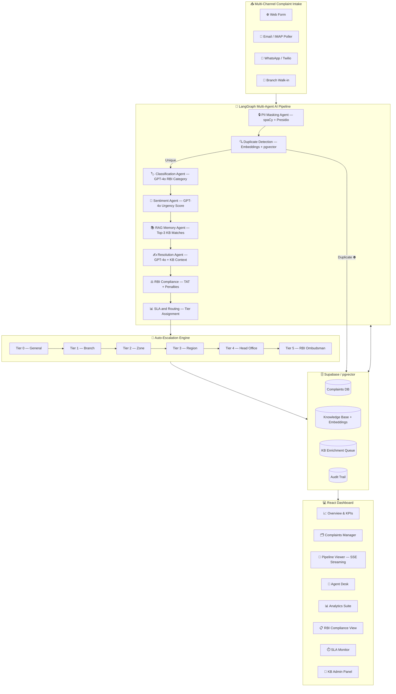
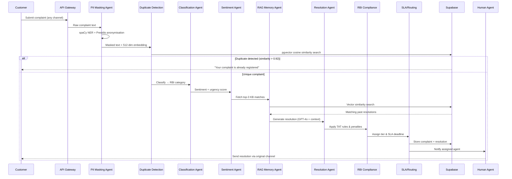
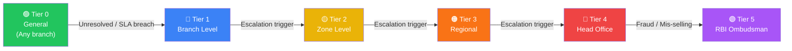

<div align="center">


# 🏦 CustomerSetu — Intelligent Complaint Resolution Ecosystem

### _AI-Powered Multi-Agent Platform for Union Bank of India_

[](https://fastapi.tiangolo.com/)
[](https://react.dev/)
[](https://www.typescriptlang.org/)
[](https://langchain-ai.github.io/langgraph/)
[](https://openai.com/)
[](https://supabase.com/)
[](https://azure.microsoft.com/)
[](https://www.twilio.com/)

</div>

---

## 🎯 Problem Statement

> **Addressing PS: AI-Driven Complaint Management for Banking Operations**

Union Bank of India receives thousands of customer complaints daily across multiple channels — email, WhatsApp, web forms, and branches. Today, this process is **manual, slow, and inconsistent**: complaints are mis-classified, duplicates are processed redundantly, RBI TAT (Turn-Around Time) deadlines are missed, and resolution quality varies agent to agent.

**CustomerSetu** solves this with a **Gen-AI powered multi-agent pipeline** that automatically ingests complaints from every channel, detects duplicates via semantic embeddings, classifies by RBI category, generates context-aware resolutions from a live knowledge base, enforces RBI compliance, and auto-escalates from Branch → Zone → Region → Head Office → RBI Ombudsman — all in real time, with full explainability (XAI) and audit trails.

---

## 🌐 Live Demo

| Resource          | Link                                                                                               |
| ----------------- | -------------------------------------------------------------------------------------------------- |
| 🚀 **Live App**   | [proud-plant-0e6ce2600.7.azurestaticapps.net](https://proud-plant-0e6ce2600.7.azurestaticapps.net) |
| 📹 **Demo Video** | _Coming Soon_                                                                                      |
| 📖 **API Docs**   | [`/docs` (Swagger UI on deployed backend)  ](https://complaint-dashboard-api.azurewebsites.net/docs) |                                                         |

> If accessing locally: follow the **How to Run Locally** section below.

---

## 🏗️ System Architecture



---

## 🤖 AI Pipeline — Step-by-Step Flow



---

## 🧩 Escalation Logic



**Agent Specialisation Map:**

| Tier | Agents               | Domain                                    |
| ---- | -------------------- | ----------------------------------------- |
| 0    | Rishi, Alok, Shaunak | UPI/ATM, General Banking, Internet/Mobile |
| 1    | Saket, Prince        | Branch/KYC, Home/Personal Loan            |
| 2    | Shubham              | Business Loan, Insurance                  |
| 3    | Shubham Kumar        | Regional Compliance, Mis-selling          |
| 4–5  | Sarthak              | Nodal Office, Fraud, RBI Escalation       |

---

## ✨ Key Features

<table>
<tr>
<td width="50%">

### 🔁 Multi-Channel Ingestion

- **Email:** IMAP polling every 30s (Gmail)
- **WhatsApp:** Twilio webhook integration with QR onboarding
- **Web:** React complaint submission form with OCR image support
- **Branch:** Direct entry via Agent Desk

</td>
<td width="50%">

### 🧠 AI Intelligence

- **PII Masking:** spaCy NER + Microsoft Presidio (names, Aadhaar, phone, account numbers)
- **Duplicate Detection:** 512-dim OpenAI embeddings + pgvector cosine similarity (>0.92 threshold)
- **Semantic RAG:** Top-3 knowledge base matches injected into resolution prompt

</td>
</tr>
<tr>
<td width="50%">

### ⚖️ RBI Compliance

- TAT rules per RBI category (30-day resolution window)
- Auto-penalty calculation (₹100/day for TAT breach categories)
- Real-time SLA countdown with breach alerts
- Full RBI compliance view and override audit trail

</td>
<td width="50%">

### 📊 Analytics Suite

- **Overview:** KPI cards, channel distribution, complaint feed
- **AI Performance:** Resolution quality, agent efficiency
- **Root Cause Analysis:** Category & trend breakdown
- **Customer Feedback:** NPS-style post-resolution surveys

</td>
</tr>
<tr>
<td width="50%">

### 🧠 KB Auto-Enrichment

- Resolved complaints auto-scored and queued for KB addition
- Quality threshold gating: ≥0.95 → auto-approve, 0.70–0.95 → admin review
- Bulk CSV/JSON import with per-row validation
- Tier-scoped entries (Branch → Ombudsman level)

</td>
<td width="50%">

### 🔴 Real-Time Streaming

- Server-Sent Events (SSE) for live pipeline step updates
- Each agent node streams its status to the Pipeline Viewer tab
- Rate limiting (10 req/min) with 429 + Retry-After headers

</td>
</tr>
</table>

---

## 🛠️ Tech Stack

### Backend

| Library                          | Version              | Purpose                                      |
| -------------------------------- | -------------------- | -------------------------------------------- |
| **FastAPI**                      | 0.136                | Async REST API framework                     |
| **LangGraph**                    | 1.1.10               | Multi-agent orchestration DAG                |
| **LangChain-OpenAI**             | 1.2.1                | GPT-4o integration                           |
| **OpenAI SDK**                   | 2.33                 | Embeddings (text-embedding-3-small, 512-dim) |
| **spaCy**                        | 3.8 + en_core_web_lg | Named Entity Recognition for PII             |
| **Presidio Analyzer/Anonymizer** | 2.2                  | PII detection and masking                    |
| **Supabase**                     | 2.29                 | PostgreSQL + pgvector cloud database         |
| **Twilio**                       | 9.6                  | WhatsApp Business API                        |
| **imap-tools**                   | 1.7                  | IMAP email polling                           |
| **pytesseract**                  | 0.3                  | OCR for image-based complaints               |
| **Pillow**                       | 12.2                 | Image processing                             |
| **slowapi**                      | 0.1.9                | API rate limiting                            |
| **sse-starlette**                | 3.4                  | Server-Sent Events streaming                 |
| **pydantic-settings**            | 2.14                 | Type-safe configuration                      |
| **uvicorn**                      | 0.46                 | ASGI server                                  |
| **numpy**                        | 2.4                  | Cosine similarity computation                |

### Frontend

| Library               | Version | Purpose                      |
| --------------------- | ------- | ---------------------------- |
| **React**             | 18      | Component UI framework       |
| **TypeScript**        | 5       | Type-safe JavaScript         |
| **Vite**              | Latest  | Build tooling & dev server   |
| **Tailwind CSS**      | 3       | Utility-first styling        |
| **React Router DOM**  | 6       | Client-side routing          |
| **Lucide React**      | Latest  | Icon library                 |
| **EventSource (SSE)** | Native  | Real-time pipeline streaming |

### Infrastructure

| Service                   | Purpose                                                      |
| ------------------------- | ------------------------------------------------------------ |
| **Azure Static Web Apps** | Frontend hosting                                             |
| **Supabase**              | PostgreSQL + pgvector (vector similarity search)             |
| **Gmail (SMTP/IMAP)**     | Inbound email polling + outbound replies                     |
| **Twilio**                | WhatsApp webhook & message delivery                          |
| **OpenAI**                | GPT-4o (classification, resolution) + text-embedding-3-small |

---

## 🚀 How to Run Locally

### Prerequisites

- Python 3.11+
- Node.js 20+
- [Tesseract OCR](https://github.com/tesseract-ocr/tesseract) installed at `C:\Program Files\Tesseract-OCR\tesseract.exe` (Windows) or `/usr/bin/tesseract` (Linux/Mac)
- A [Supabase](https://supabase.com/) project with pgvector enabled
- OpenAI API key
- (Optional) Twilio account for WhatsApp

### 1. Clone the Repository

```bash
git clone https://github.com/your-team/CustomerSetu
cd CustomerSetu
```

### 2. Backend Setup

```bash
cd backend

# Create virtual environment
python -m venv venv
source venv/bin/activate        # Linux/Mac
# OR: venv\Scripts\activate     # Windows PowerShell

# Install dependencies
pip install -r requirements.txt

# Download spaCy language model
python -m spacy download en_core_web_lg
```

### 3. Configure Environment Variables

Create `backend/.env`:

```env
# OpenAI
OPENAI_API_KEY=sk-...
OPENAI_VISION_MODEL=gpt-4o
OPENAI_EMBEDDING_MODEL=text-embedding-3-small
OPENAI_EMBEDDING_DIMENSION=512

# Supabase
SUPABASE_URL=https://your-project.supabase.co
SUPABASE_KEY=your-anon-key
SUPABASE_STORAGE_BUCKET=complaint-images

# API Security
API_KEY=your-secure-api-key

# Email (for IMAP polling + SMTP replies)
SMTP_USER=yourbank@gmail.com
SMTP_PASSWORD=your-gmail-app-password
ENABLE_EMAIL_POLLER=true

# Twilio WhatsApp (optional)
TWILIO_ACCOUNT_SID=ACxxx
TWILIO_AUTH_TOKEN=xxx
TWILIO_WHATSAPP_NUMBER=whatsapp:+14155238886
WEBHOOK_BASE_URL=https://your-ngrok-url.ngrok.io

# Tesseract path (Windows example)
TESSERACT_CMD=C:\Program Files\Tesseract-OCR\tesseract.exe

# App
APP_ENV=development
FRONTEND_BASE_URL=http://localhost:5173
```

### 4. Start the Backend

```bash
cd backend
uvicorn app.main:app --reload --port 8000
```

API docs available at: **http://localhost:8000/docs**

### 5. Frontend Setup

```bash
cd frontend

# Create frontend/.env
echo "VITE_API_URL=http://localhost:8000" > .env

# Install dependencies
npm install

# Start dev server
npm run dev
```

Open your browser at: **http://localhost:5173**

### 6. (Optional) Database Schema

Run the Supabase migrations in order. The required tables are:

- `complaints` — main complaint records with pgvector embedding column `VECTOR(512)`
- `knowledge_base` — resolution KB with embedding column `VECTOR(512)`
- `kb_enrichment_queue` — auto-generated KB candidates awaiting review
- `agent_assignments` — tier-to-agent routing

Enable the `vector` extension in Supabase SQL editor:

```sql
CREATE EXTENSION IF NOT EXISTS vector;
```

---

## 📁 Project Structure

```
CustomerSetu/
├── backend/
│   ├── app/
│   │   ├── api/v1/routes/          # FastAPI route handlers
│   │   │   ├── complaints.py       # Complaint CRUD + pipeline trigger
│   │   │   ├── pipeline.py         # SSE streaming endpoint
│   │   │   ├── kb_admin.py         # Knowledge base CRUD + bulk import
│   │   │   ├── analytics.py        # Dashboard analytics
│   │   │   └── sla.py              # SLA monitoring
│   │   ├── services/
│   │   │   ├── agents/
│   │   │   │   ├── duplicate_agent.py   # Embedding + cosine similarity
│   │   │   │   ├── rag_agent.py         # RAG retrieval from KB
│   │   │   │   └── grounding_agent.py   # XAI explanation generation
│   │   │   ├── image_handler/
│   │   │   │   ├── ocr.py               # Tesseract OCR
│   │   │   │   ├── vision.py            # GPT-4o Vision analysis
│   │   │   │   └── supervisor/graph.py  # LangGraph pipeline DAG
│   │   │   ├── rbi/
│   │   │   │   ├── categories.py        # RBI complaint categories enum
│   │   │   │   ├── tat_rules.py         # TAT rules & penalty config
│   │   │   │   └── override_rules.py    # Shadow override system
│   │   │   ├── feedback/
│   │   │   │   └── agent_feedback.py    # Post-resolution feedback loop
│   │   │   └── email_poller.py         # IMAP background task
│   │   ├── core/config.py              # Pydantic settings (env vars)
│   │   ├── db/supabase_client.py       # Supabase client singleton
│   │   ├── middleware/
│   │   │   ├── auth.py                 # X-API-Key validation
│   │   │   └── rate_limiter.py         # slowapi 10 req/min
│   │   └── main.py                     # FastAPI app + CORS + lifespan
│   └── requirements.txt
│
└── frontend/
    └── src/
        ├── components/
        │   ├── home/                   # Landing page + MainApp shell
        │   ├── overview/               # KPI cards, channel bar, feed
        │   ├── complaints/             # Complaints table + detail modal
        │   ├── pipeline/               # Real-time SSE pipeline viewer
        │   ├── agent/                  # Agent desk (queue + assignment)
        │   ├── analytics/              # 4 analytics sub-tabs
        │   ├── rbi/                    # RBI compliance view
        │   ├── sla/                    # SLA at-risk monitor
        │   ├── kb/                     # KB admin panel with queue
        │   ├── chatbot/                # Rule-based + AI chatbot
        │   └── submit/                 # Complaint submission form
        ├── lib/
        │   ├── api.ts                  # All API client calls
        │   └── pipelineSse.ts          # SSE event listener
        └── types/index.ts              # Shared TypeScript types
```

---

## 🗄️ Dataset

All data is **real-time and system-generated** — no pre-existing dataset required.

### Synthetic Seed Data (for demo/testing)

The system is designed for live operation. For local testing, you can seed the knowledge base using the built-in bulk import endpoint.

**Sample KB entries (CSV format):**

```csv
tier_level,tier_scope,category,issue_type,resolution_text,quality_score,verified
0,,UPI,Transaction Failed,"Dear Customer, we have investigated your UPI failed transaction. As per RBI TAT guidelines, the reversal will be processed within 5 working days. We sincerely apologize.",0.90,true
1,BRANCH:BR_MH_001,ATM,ATM Cash Not Dispensed,"Dear Customer, we apologize for the ATM inconvenience. After verification, a provisional credit has been applied. Please visit the branch with your receipt for final resolution within 5 working days.",0.85,true
0,,Debit Card,Unauthorized Transaction,"Dear Customer, your disputed transaction has been flagged for investigation. Under RBI limiting-liability guidelines, a provisional credit will be issued within 10 working days pending investigation outcome.",0.92,true
```

**Download the import template directly from the running API:**

```bash
# CSV template
curl http://localhost:8000/api/v1/admin/kb/templates/csv -o kb_template.csv

# JSON template
curl http://localhost:8000/api/v1/admin/kb/templates/json -o kb_template.json
```

**Import into knowledge base:**

```bash
curl -X POST http://localhost:8000/api/v1/admin/kb/bulk-import \
  -H "X-API-Key: your-api-key" \
  -F "file=@kb_template.csv"
```

### How Complaint Data Is Generated

The platform generates data organically as complaints flow through the pipeline:

- **Complaint embeddings:** Auto-generated at submission time using OpenAI `text-embedding-3-small` (512-dim)
- **KB auto-enrichment:** After each resolution, the system scores and queues high-quality resolutions (confidence ≥ 0.70) for KB addition
- **Auto-approval:** Entries scoring ≥ 0.95 are automatically promoted to the knowledge base without manual review

---

## ⚠️ Known Limitations

| Limitation                     | Detail                                                                                                                                                                                                             |
| ------------------------------ | ------------------------------------------------------------------------------------------------------------------------------------------------------------------------------------------------------------------ |
| **No offline mode**            | The pipeline requires live OpenAI API access. If the API is geo-restricted (e.g., Azure datacenter IPs), embeddings fall back to quality-score ranking, and GPT-4o calls will fail gracefully with a logged error. |
| **Single-tenant**              | The current schema does not support multi-bank tenancy. Branch/zone/region IDs are hardcoded per deployment.                                                                                                       |
| **WhatsApp sandbox**           | The Twilio integration uses the WhatsApp sandbox (Twilio test number). Production requires a WhatsApp Business API approved number.                                                                                |
| **Email polling latency**      | IMAP poller runs every 30s by default. Near-real-time email processing requires upgrading to Gmail Push Notifications (Pub/Sub).                                                                                   |
| **No model retraining**        | The RAG agent uses static embeddings. The knowledge base improves incrementally, but the base LLM (GPT-4o) does not retrain on domain data. Fine-tuning would require a separate pipeline.                         |
| **OCR accuracy**               | Tesseract OCR works best on clean, printed documents. Handwritten complaints or low-resolution scans may produce poor extractions.                                                                                 |
| **Escalation loop guard**      | The escalation system has a hard cap of 5 hops and a 10-second cooldown per tier to prevent rapid-fire escalation. In edge cases this may delay legitimate escalations.                                            |
| **pgvector similarity search** | Vector search scales to ~100K complaints without indexing. Beyond that, an HNSW or IVFFlat index on the `embedding` column is needed for acceptable latency.                                                       |

---

## 📊 Performance Metrics (on Live Demo Data)

| Metric                        | Value                                             |
| ----------------------------- | ------------------------------------------------- |
| Duplicate detection threshold | cosine similarity > **0.92**                      |
| Embedding dimensions          | **512** (Matryoshka, 95% accuracy at 1/3 storage) |
| KB auto-approve threshold     | quality score ≥ **0.95**                          |
| KB review threshold           | quality score ≥ **0.70**                          |
| RBI resolution SLA            | **30 calendar days** (all categories)             |
| Rate limit                    | **10 requests/minute** per client                 |
| Email poll interval           | **30 seconds**                                    |
| Max escalation hops           | **5** (Tier 0 → RBI Ombudsman)                    |
| Max file size (OCR upload)    | **10 MB**                                         |

---

## 👥 Team

| Name                | Role & Contributions                                                                    |
| ------------------- | --------------------------------------------------------------------------------------- |
| **Saket**           | Backend architecture, LangGraph pipeline, escalation engine, email/WhatsApp integration |
| **Anijeet**         | Frontend React dashboard, SSE pipeline viewer, analytics suite, KB admin UI             |
| **[Team Member 3]** | RAG knowledge base design, Supabase schema, pgvector integration                        |
| **[Team Member 4]** | RBI compliance module, TAT rules engine, SLA monitoring, domain research                |

---

## 📬 Contact

|               |                                                                        |
| ------------- | ---------------------------------------------------------------------- |
| **Team Name** | CustomerSetu                                                           |
| **Institute** | _RGIPT(an institution of national Importance, along the line of IITs)_ |
| **Email**     | jhasaket99dbg@gmail.com                                                |
| **Hackathon** | iDEA 2.0 — Phase 2 Submission                                          |

---

<div align="center">

**Built for Union Bank of India · iDEA 2.0 Hackathon 2026**

[](https://fastapi.tiangolo.com/)
[](https://langchain-ai.github.io/langgraph/)
[](https://openai.com/)
[](https://supabase.com/)
[](https://react.dev/)

</div>
